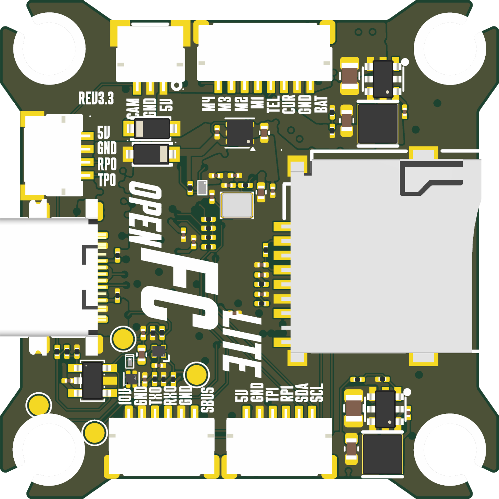

# OpenFC-Lite

Open source Betaflight flight controller built on the RP2354B, 30.5 x 30.5 mm
mounting pattern, part of the incutec OpenDrone line.

## Specifications

| | |
|---|---|
| Firmware | Betaflight |
| MCU | RP2354B |
| IMU | BMI270 |
| Barometer | None |
| Blackbox | microSD |
| OSD | Analog and digital |
| UARTs | 4 |
| Motor outputs | 4x DShot, bidirectional |
| RX | External, CRSF or SBUS |
| Input | 3-8S LiPo (9.0-33.6 V) |
| BEC | 10 V switchable + 5 V always-on, 3.5 A |
| Current sense | Yes |
| USB | USB-C |
| Mounting | 30.5 x 30.5 mm, 4.0 mm holes |
| Dimensions | 37.9 x 37.9 mm |
| PCB | 6-layer, 1.6 mm |

Technical write-up, part list and layout constraints: [AGENTS.md](AGENTS.md).

## In the line

What pairs with what, and what is available:
[opendrone.be](https://opendrone.be).

## Contributing

See [CONTRIBUTING.md](CONTRIBUTING.md).

## License

Hardware licensed under [CERN-OHL-S-2.0](https://ohwr.org/cern_ohl_s_v2.txt),
see [LICENSE](LICENSE).
